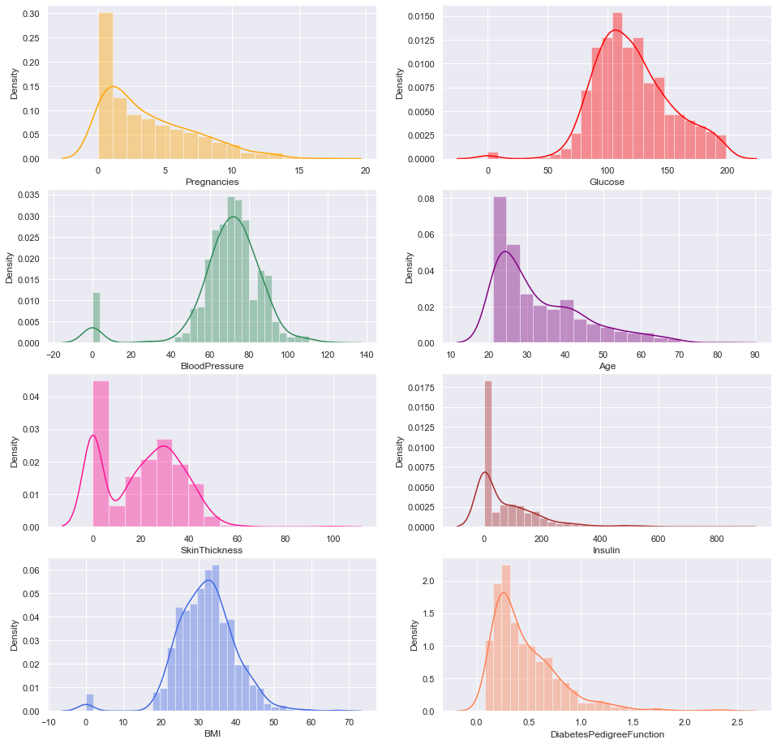
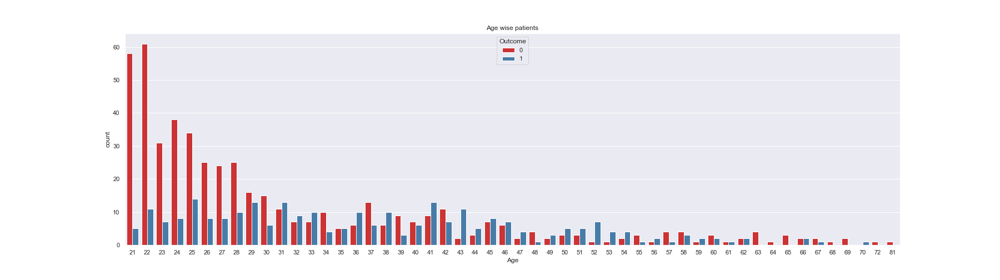

# Diabetes-Prediction-Using-All-Classification-Algorithms

Details:

   * @Author : Dwarka prasad Bairwa
   
   * File Name : classification_Algorithms(including neural network) for diabetes dataset.ipynb

   * Dataset : [Diabetes Dataset](https://www.kaggle.com/uciml/pima-indians-diabetes)

   * Reference Sites: [kaggle](https://www.kaggle.com/) ,  [Medium](https://www.medium.com/)

Topics :

   1. [Diabetes Dataset Prediction](#Diabetes-Dataset-Prediction)
   2. [Modules](#Modules)
   3. [Data Visualization](#Data-Visualization)
   4. [Measuring Performance](#Measuring-Performance)
   5. [Logistic Regression](#Logistic-Regression)
   6. [KNN](#KNN)
   7. [Decision Tree Classifier](#Decision-Tree-Classifier)
   8. [Random Forest Classifier](#Random-Forest-Classifier)
   9. [Support Vector Machine](#Support-Vector-Machine)
   10. [Neural Network](#Neural-Network)
          * [Using Scikit learn](#Using-Scikit-Learn)
          * [Using Tesnorflow Keras](#Using-Tesnorflow-Keras)
   11. [Naive Bays Classifier](#Naive-Bays-Classifier)
   12. [Gradient Boosting Classifier](#Gradient-Boosting-Classifier)

# Diabetes-Dataset-Prediction

1. I used the following classification Algorithms for the predictions:

   * Logistic Regression
   * KNN
   * Random Forest
   * Decision Tree
   * Support Vector Machine
   * Neural Network
      * Using Scikit MLP Classifier
      * Using TensorFlow.Keras
   * Naive Bays
   * GradientBoosting Classifier

2. Find Results For Each Algorithms:

   * Accuracy
   * precision
   * recall
   * f1-score
   * Confusion Matrix

3. Data Visualization

4. Library Used:

   * `Scikit-learn`

   * `Matplotlib`

   * `Pandas`

   * `Numpy`

   * `Seaborn`

   * `Tensorflow` __For Neural Network__
   
## DATASET VISUALIZATION

  * __Counting Number of lables in the Dataset__

  * __plotting distributions of each feature__

  * __Age Wise Label Distributions__
  
 

